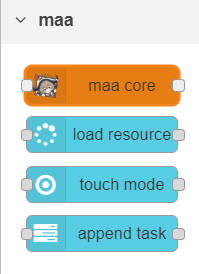
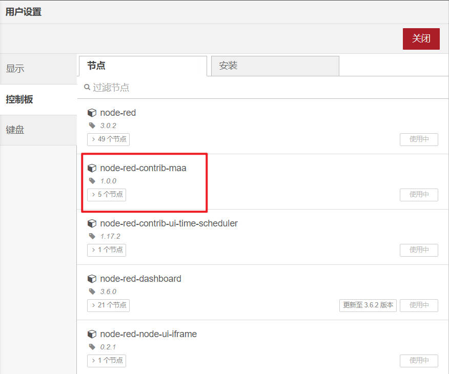

# node-red-contrib-maa

> 警告：本人目前只在linux docker环境下验证过该节点功能，其他环境都没试过。另外本人前端知识很烂，所以才会选择用Node-RED这种低代码平台来实现功能

A Node-RED node to call C/C++ program named MaaAssistantArknights

本项目的核心代码从[MaaX](https://github.com/MaaAssistantArknights/MaaX/blob/main/packages/main/coreLoader/index.ts)移植，用于在Node-RED中调用[MaaAssistantArknights](https://github.com/MaaAssistantArknights/MaaAssistantArknights)。


## 使用说明

1. 进入Node-Red所在服务器，拉取源码到本地

2. 执行安装命令，切记一定是项目的`绝对路径`

   ```
   npm install /absolute/path/to/node-red-contrib-maa
   ```

3. 进入Node-RED页面，在左侧侧节点栏可以找到maa类型的四个节点。右上角下拉栏的`节点管理`中也能看到node-red-contrib-maa已安装

   

4. 复制[maa.json](./flow/maa.json)的内容，在Node-RED页面右上角下拉导入选项，粘贴并单击导入

   - 导入后会提示缺少某些节点，主要涉及显示和定时任务的实现，不影响主要功能，可以删除。有需要可以在右上角下拉栏的`节点管理`中安装以下节点
     - node-red-dashboard
     - node-red-node-ui-iframe
     - node-red-contrib-ui-time-scheduler

   - 下载maa和adb的linux版本，并把这些文件/文件夹所在绝对路径以及安卓手机的adb地址配置到下图这些位置。

     

   - `修改完以后，一定一定记得点击右上角的部署按钮，不然无法更新到服务器上`，部署成功右侧会出现maaCore的版本信息等

     

5. 流程的修改和使用需要配合官方的集成文档，贴一个跳转链接[官方文档地址](https://maa.plus/docs/3.1-%E9%9B%86%E6%88%90%E6%96%87%E6%A1%A3.html)


## 在Docker中部署

> 测试过用官方镜像使用的是debian11 buster，maa会报glibc本版过低的错，所以需要修改一下官方的打包脚本打一个基于debian12的Node-RED镜像

1.拉取官方镜像

```
git clone https://github.com/node-red/node-red-docker.git
```

2.修改[./docker-custom/Dockerfile.debian](https://github.com/node-red/node-red-docker/blob/master/docker-custom/Dockerfile.debian)文件内容

```
#第三行版本buster-slim改成bookworm-slim
ARG ARCH=amd64
ARG NODE_VERSION=16
ARG OS=bookworm-slim

...

# 出现python的地方改成python3，不然打包会报错
python -> python3
```

3.赋权，并执行[docker-debian.sh](https://github.com/node-red/node-red-docker/blob/master/docker-custom/docker-debian.sh)

```
# 根据自身需求修改脚本中的镜像版本信息
chmod +wx docker-debian.sh && ./docker-debian.sh
```

4.映射本项目源码文件夹到容器中

```
docker run -it \
    -p 1880:1880 \
    -v /absolute/path/to/maa4node-red:/data \
    --name mynodered \
    nodered/node-red:your-version
```

5.安装节点路径、以及配置maaCore和adb的路径，都得配置`容器中的绝对路径`

```
# 进入容器中执行
docker exec -ti mynodered sh
npm install /container/absolute/path/to/node-red-contrib-maa

# 或者在命令前加上docker exec
docker exec -ti mynodered npm install /container/absolute/path/to/node-red-contrib-maa
```

